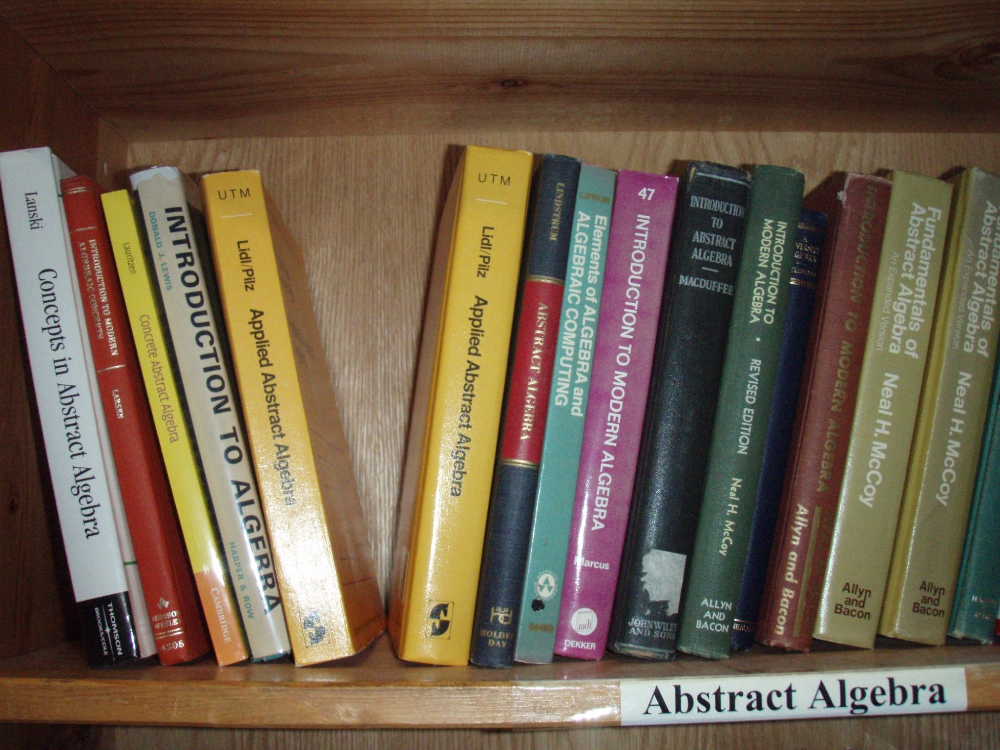

Where are we?
=============

Part 1: Intro to FP
-------------------

- What is it
- Datastructures
- Error handling
- Strict vs lazy
- Pure state

Part 2: Functional design and combinator libraries
--------------------------------------------------

- Parallelism
- Poperty-based testing
- **Parser combinators**

Part 3: Common structures in functional design
----------------------------------------------

- **Monoids**

Chapter 9: Parsers
==================

It's the journey man
--------------------

.. image:: journey.jpg

----

- Focus is on *algebraic design*
- Parser combinators used to show off design methodology

What's a parser?
----------------

    A parser for things is a function from strings to lists of pairs of things and strings.
    -- Conor McBride [#]_

.. [#] `via @hackuador <https://twitter.com/hackuador/status/72567583412035993>`_

----

.. code:: scala

    def parse[A](s: String): List[(A, String)]

----

- Unstructured data to structured
- e.g. `String` to `Sale` data type

----

- Difference between parser *combinators* and *generators*
- *combinators* for defining parsers by hand
- *generators* produce a parser from a grammar

Algebra first design
--------------------

 
.. [#]_

.. [#] CC `kirbyurner on Flickr <https://www.flickr.com/photos/kirbyurner/3176286128>`_

Algebra loosely defined as data types, functions over them, and laws that specify
how they must work

How should our parser work?
---------------------------

- `String` as input
- Bake good error values in from the beginning
- Build up from primitive combinators

Candidate primitive
-------------------

.. code:: scala

   def char(c: Char): Parser[Char]

Running
-------

Not quite Conor's type signature, but...

.. code:: scala

   def run[A](p: Parser[A])(s: String):
           Either[ParseError, A]
